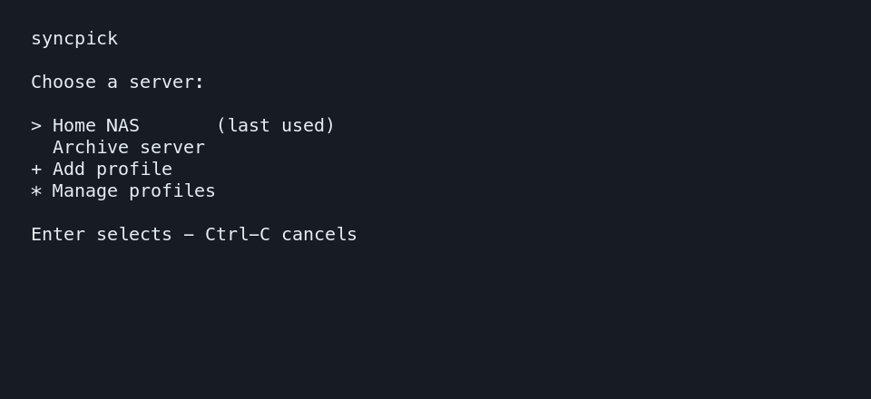

# syncpick

An interactive `fzf` picker for copying selected folders from SSH servers with
`rsync`. It is a small Zsh script: configure a server once, select it, pick the
remote folders you want, and sync them into a local directory.



## Requirements

- Zsh
- `ssh` with an already-working authentication setup
- `rsync` (3.x recommended)
- [`fzf`](https://github.com/junegunn/fzf)

syncpick works on macOS and Linux when these tools are available. It discovers
executables through `PATH`; a profile can override the `ssh` or `rsync` path.

## Install

### Homebrew

On macOS or Linux with [Homebrew](https://brew.sh/):

```sh
brew install Cyberlane/tap/syncpick
```

### From source

Clone this repository, then run:

```sh
./install
```

This creates `~/.local/bin/syncpick` (or `$XDG_BIN_HOME/syncpick`). Ensure that
directory is in your `PATH`.

For an optional `sp` shorthand command:

```sh
./install --with-alias
```

## Quick start

Create your first server profile:

```sh
syncpick --init
```

Setup asks for only a server name, its SSH host, and the remote folder roots to
browse. syncpick auto-detects `ssh` and `rsync` and starts with safe transfer
defaults. Use `syncpick --configure` later for executable overrides, deletion,
or in-place-write preferences. The source-folder manager adds and removes one
path at a time and verifies new paths over SSH when possible.

Then run syncpick in the directory where copies should go:

```sh
cd ~/Downloads
syncpick
```

The server picker remembers the last successfully synced profile. Use
`syncpick --configure` to add, edit, or remove profiles, or select one directly:

```sh
syncpick --server home-nas ~/Downloads
syncpick --dry-run
```

The folder picker lists directories only. `>` is the navigation cursor and `✓`
marks folders queued to sync: after marking one or more folders with `Tab`, only
those checked folders transfer. If nothing is checked, pressing Enter transfers
the cursor folder; the confirmation screen always lists exactly what will sync.
The parent portion of each path is muted and its final folder name highlighted
by default; disable that per profile under **Highlight folder names** in
`syncpick --configure` if you prefer plain paths. Under **Queued folder path
display**, choose whether the queue shows full paths, shortened paths such as
`…/media/show`, or folder names only. The same highlighting is used in the
queue whenever it is enabled.

For long lists, the right-hand **Queued folders** pane shows every checked
folder as you select it. Press `Ctrl-P` to hide or restore that pane.

## Safety defaults

syncpick asks before a real transfer. It does **not** delete unmatched local
files, and uses rsync's safer temporary-file behavior by default.

For a non-interactive run, pass `--yes` (or `-y`) to accept the final transfer
summary automatically:

```sh
syncpick --server home-nas --yes ~/Downloads
```

Deletion and `--inplace` writes can be set per profile in the settings TUI or
enabled for one run:

```sh
syncpick --delete
syncpick --inplace
```

Use `--dry-run` before a large or destructive transfer.

## Configuration and privacy

Profiles are stored locally at `$XDG_CONFIG_HOME/syncpick` (default:
`~/.config/syncpick`); recent-profile state is stored at `$XDG_STATE_HOME/syncpick`
(default: `~/.local/state/syncpick`). These directories and profile files are
created with private permissions.

Profiles contain a display name, SSH host, source folders, optional executable
overrides, and sync defaults. They do **not** store passwords, private keys, or
passphrases—use your SSH configuration, agent, or keychain for authentication.
Do not paste sensitive hostnames, usernames, IP addresses, folder names, or
transfer output into public issues.

## Releases

syncpick is a portable source script, so compiled binaries are unnecessary.
Releases use semantic versioning and are available through the Cyberlane
Homebrew tap as well as the source repository.

## Contributing

See [CONTRIBUTING.md](CONTRIBUTING.md). Please report vulnerabilities privately
as described in [SECURITY.md](SECURITY.md).

## License

[MIT](LICENSE).
